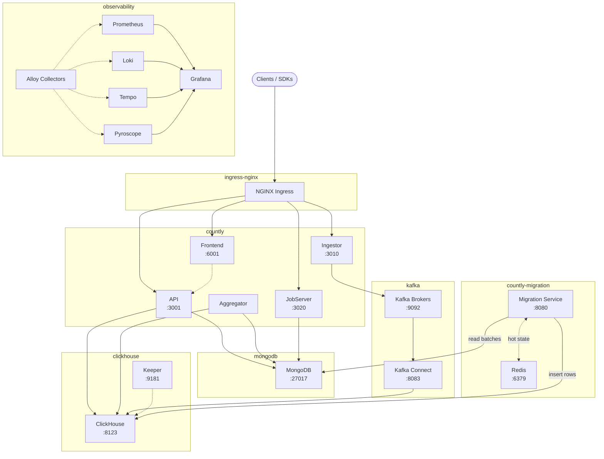
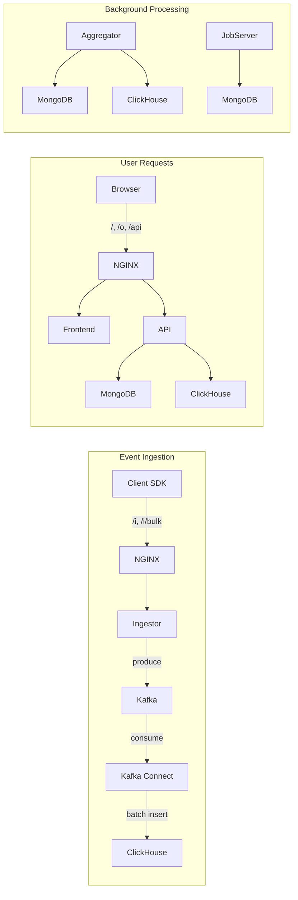
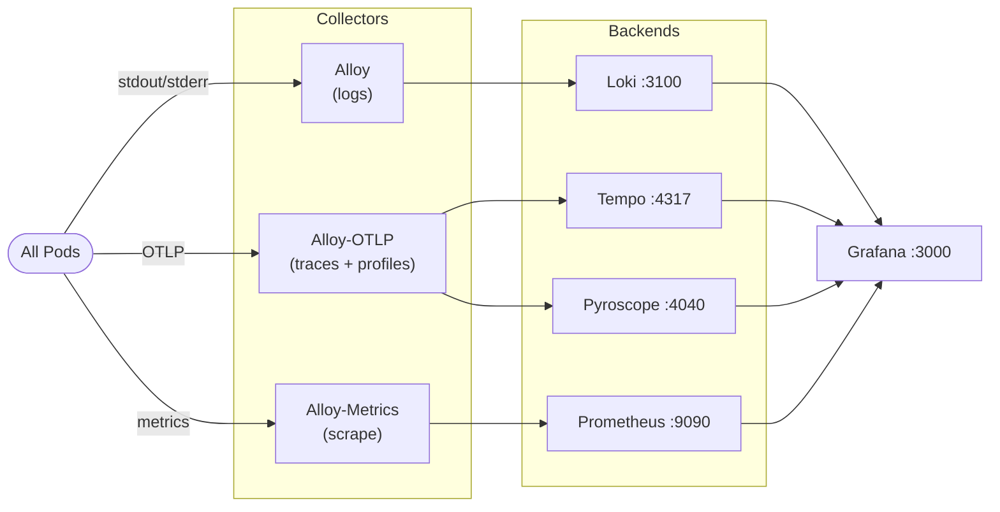

# Countly Helm Charts

Helm charts for deploying Countly analytics on Kubernetes.

## Architecture

Six charts, each in its own namespace:

| Chart | Namespace | Purpose |
|-------|-----------|---------|
| `countly` | countly | Application (API, Frontend, Ingestor, Aggregator, JobServer) |
| `countly-mongodb` | mongodb | MongoDB via MongoDB Community Operator |
| `countly-clickhouse` | clickhouse | ClickHouse via ClickHouse Operator |
| `countly-kafka` | kafka | Kafka via Strimzi Operator |
| `countly-observability` | observability | Prometheus, Grafana, Loki, Tempo, Pyroscope |
| `countly-migration` | countly-migration | MongoDB to ClickHouse batch migration (with bundled Redis) |

### Architecture Overview



### Data Flow



### Observability Pipeline



## Quick Start

### Prerequisites

Install required operators before deploying Countly. See [docs/PREREQUISITES.md](docs/PREREQUISITES.md).

### Deploy

1. **Copy the reference environment:**
   ```bash
   cp -r environments/reference environments/my-deployment
   ```

2. **Edit `environments/my-deployment/global.yaml`:**
   - Set `ingress.hostname` to your domain
   - Choose `global.sizing`: `local`, `small`, or `production`
   - Choose `global.tls`: `none`, `letsencrypt`, `provided`, or `selfSigned`
   - Choose `global.observability`: `disabled`, `full`, `external-grafana`, or `external`
   - Choose `global.kafkaConnect`: `throughput`, `balanced`, or `low-latency`
   - Choose `global.security`: `open` or `hardened`

3. **Fill in required secrets** in the chart-specific files. See `environments/reference/secrets.example.yaml` for a complete reference.

4. **Register your environment** in `helmfile.yaml.gotmpl`:
   ```yaml
   environments:
     my-deployment:
       values:
         - environments/my-deployment/global.yaml
   ```

5. **Deploy:**
   ```bash
   helmfile -e my-deployment apply
   ```

### GitOps Customer Onboarding

For Argo CD managed deployments, scaffold a new customer/cluster with:

```bash
./scripts/new-argocd-customer.sh <customer> <server> <hostname>
```

This creates:
- `environments/<customer>/`
- `argocd/customers/<customer>.yaml`

Then:
1. fill in `environments/<customer>/secrets-*.yaml`
2. commit
3. sync `countly-bootstrap`

### Manual Installation (without Helmfile)

```bash
helm install countly-mongodb ./charts/countly-mongodb -n mongodb --create-namespace \
  --wait --timeout 10m \
  -f environments/my-deployment/global.yaml \
  -f profiles/sizing/production/mongodb.yaml \
  -f environments/my-deployment/mongodb.yaml \
  -f environments/my-deployment/secrets-mongodb.yaml

helm install countly-clickhouse ./charts/countly-clickhouse -n clickhouse --create-namespace \
  --wait --timeout 10m \
  -f environments/my-deployment/global.yaml \
  -f profiles/sizing/production/clickhouse.yaml \
  -f environments/my-deployment/clickhouse.yaml \
  -f environments/my-deployment/secrets-clickhouse.yaml

helm install countly-kafka ./charts/countly-kafka -n kafka --create-namespace \
  --wait --timeout 10m \
  -f environments/my-deployment/global.yaml \
  -f profiles/sizing/production/kafka.yaml \
  -f profiles/kafka-connect/balanced/kafka.yaml \
  -f environments/my-deployment/kafka.yaml \
  -f environments/my-deployment/secrets-kafka.yaml

helm install countly ./charts/countly -n countly --create-namespace \
  --wait --timeout 10m \
  -f environments/my-deployment/global.yaml \
  -f profiles/sizing/production/countly.yaml \
  -f profiles/tls/letsencrypt/countly.yaml \
  -f environments/my-deployment/countly.yaml \
  -f environments/my-deployment/secrets-countly.yaml

helm install countly-observability ./charts/countly-observability -n observability --create-namespace \
  --wait --timeout 10m \
  -f environments/my-deployment/global.yaml \
  -f profiles/sizing/production/observability.yaml \
  -f profiles/observability/full/observability.yaml \
  -f environments/my-deployment/observability.yaml

# Optional: MongoDB to ClickHouse batch migration (includes bundled Redis)
helm install countly-migration ./charts/countly-migration -n countly-migration --create-namespace \
  --wait --timeout 5m \
  -f environments/my-deployment/migration.yaml \
  -f environments/my-deployment/secrets-migration.yaml
```

## Configuration Model

```
chart defaults -> profiles (sizing + dimensions) -> environment (choices) -> secrets
```

### Profiles (`profiles/`)

Composable profile dimensions — select one value per dimension in `global.yaml`:

| Dimension | Options | Controls |
|-----------|---------|----------|
| `sizing` | `local`, `small`, `production` | CPU/memory, replicas, HPA, PDBs |
| `observability` | `disabled`, `full`, `external-grafana`, `external` | Observability stack deployment mode |
| `kafkaConnect` | `throughput`, `balanced`, `low-latency` | Batch sizes, write frequency, memory |
| `tls` | `none`, `letsencrypt`, `provided`, `selfSigned` | Ingress TLS configuration |
| `security` | `open`, `hardened` | Network policy enforcement level |

### Environments (`environments/`)

Environments contain deployment-specific choices:
- `global.yaml` — Profile selectors, hostname, backing service modes
- `<chart>.yaml` — Per-chart overrides (tuning, network policy, OTEL)
- `secrets-<chart>.yaml` — Per-chart secrets (gitignored)

### Deployment Modes

| Mode | Options | Documentation |
|------|---------|---------------|
| TLS | Profile: `none` / `letsencrypt` / `provided` / `selfSigned`. Chart values: `http` / `letsencrypt` / `existingSecret` / `selfSigned` | [DEPLOYMENT-MODES.md](docs/DEPLOYMENT-MODES.md) |
| Backing Services | `bundled`, `external` (per service) | [DEPLOYMENT-MODES.md](docs/DEPLOYMENT-MODES.md) |
| Secrets | `values`, `existingSecret`, `externalSecret` | [SECRET-MANAGEMENT.md](docs/SECRET-MANAGEMENT.md) |
| Observability | `full`, `hybrid`, `external`, `disabled` | [DEPLOYMENT-MODES.md](docs/DEPLOYMENT-MODES.md) |

## Documentation

- [DEPLOYING.md](docs/DEPLOYING.md) — Step-by-step deployment guide
- [DEPLOYMENT-MODES.md](docs/DEPLOYMENT-MODES.md) — TLS, observability, backing service modes
- [SECRET-MANAGEMENT.md](docs/SECRET-MANAGEMENT.md) — Secret modes, rotation, ESO integration
- [PREREQUISITES.md](docs/PREREQUISITES.md) — Required operators and versions
- [HARDENING.md](docs/HARDENING.md) — Security hardening, compliance, backup/DR
- [VERIFICATION.md](docs/VERIFICATION.md) — Chart signature verification, SBOM, provenance
- [TROUBLESHOOTING.md](docs/TROUBLESHOOTING.md) — Common issues and fixes
- [VERSION-MATRIX.md](docs/VERSION-MATRIX.md) — Pinned operator and image versions

## Repository Structure

```
helm/
  charts/                           # Helm charts (independently publishable as OCI)
    countly/
    countly-mongodb/
    countly-clickhouse/
    countly-kafka/
    countly-observability/
  profiles/                         # Composable profile dimensions
    sizing/                         # local | small | production
    observability/                  # disabled | full | external-grafana | external
    kafka-connect/                  # throughput | balanced | low-latency
    tls/                            # none | letsencrypt | provided | selfSigned
    security/                       # open | hardened
  environments/                     # Deployment environments
    reference/                      # Copy this to start (all values documented)
    local/                          # Local development
    example-small/                  # Example: small deployment
    example-production/             # Example: production deployment
  .github/workflows/                # CI/CD
    publish-oci.yml                 # Publish, sign, and attest charts to GHCR
    changelog.yml                   # Auto-update CHANGELOG.md
    validate-charts.yml             # PR validation (lint, template, profiles)
  docs/                             # Documentation
  spec/                             # Workflow specifications
  helmfile.yaml.gotmpl              # Helmfile orchestration
```
