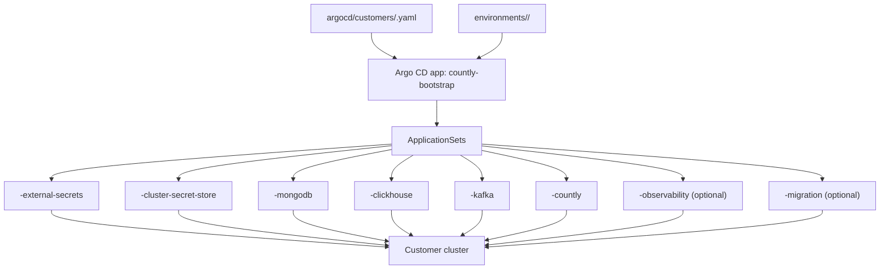
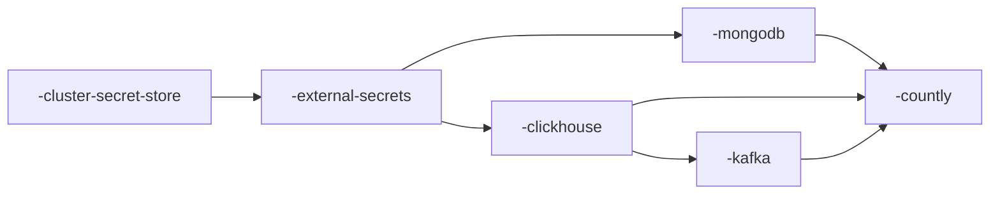

# Customer Onboarding Guide

This guide is written as a slow, step-by-step walkthrough for adding one new customer cluster.

Use this when you want to:
- create a new customer deployment
- choose between direct secrets and Secret Manager
- connect Argo CD to the new cluster
- troubleshoot the common issues we already hit once

## What You Are Building

For each customer, you will end up with:
- one Argo CD customer metadata file
- one environment folder with customer overrides
- one target Kubernetes cluster
- one set of Argo CD applications created automatically by `countly-bootstrap`
- one secret strategy:
  - direct values in Git, or
  - Google Secret Manager + External Secrets Operator

### Visual Map



## The Secret Naming Rule

Use this naming convention everywhere:

```text
<customer>-<component>-<secret>
```

Examples for customer `northstar`:

```text
northstar-gar-dockerconfig
northstar-countly-encryption-reports-key
northstar-countly-web-session-secret
northstar-countly-password-secret
northstar-countly-clickhouse-password
northstar-kafka-connect-clickhouse-password
northstar-clickhouse-default-user-password
northstar-mongodb-admin-password
northstar-mongodb-app-password
northstar-mongodb-metrics-password
```

Keep the `<customer>` slug exactly the same in:
- `argocd/customers/<customer>.yaml`
- `environments/<customer>/`
- Secret Manager secret names

## Before You Start

Make sure these are already true:

1. You can access the repo.
2. You can access the Argo CD instance.
3. The target cluster exists.
4. The target cluster is registered in Argo CD.
5. DNS is ready for the customer hostname.

Useful checks:

```bash
argocd app list
argocd cluster list
kubectl config current-context
```

## Step 1: Create The Customer Scaffold

Run:

```bash
./scripts/new-argocd-customer.sh [--secret-mode values|gcp-secrets] <customer> <server> <hostname>
```

Example:

```bash
./scripts/new-argocd-customer.sh northstar https://1.2.3.4 analytics.northstar.example.com
```

If you plan to use Google Secret Manager from the start, use:

```bash
./scripts/new-argocd-customer.sh --secret-mode gcp-secrets northstar https://1.2.3.4 analytics.northstar.example.com
```

This creates:
- `argocd/customers/northstar.yaml`
- `environments/northstar/`

The difference is:
- `values` writes the credential files in direct-password mode
- `gcp-secrets` writes the credential files already wired for External Secrets and the standard Google Secret Manager key names

## How To Read Argo CD For One Customer

Yes, in the current setup all customer apps appear in the same Argo CD dashboard view.
That is normal.

The important trick is: every generated app starts with the customer slug.

For customer `northstar`, you should expect app names like:

```text
northstar-cluster-secret-store
northstar-external-secrets
northstar-mongodb
northstar-clickhouse
northstar-kafka
northstar-countly
northstar-observability
northstar-migration
```

So when the UI feels crowded, think:
- first filter by the customer slug
- then read the apps from platform first, then data stores, then Countly

### Fast CLI Filters

List only one customer's apps:

```bash
kubectl get applications -n argocd | grep '^northstar-'
```

Get only one app:

```bash
argocd app get northstar-countly
argocd app get northstar-kafka
```

Refresh one app:

```bash
argocd app get northstar-countly --hard-refresh
```

Sync one app:

```bash
argocd app sync northstar-countly
```

Terminate a stuck sync:

```bash
argocd app terminate-op northstar-countly
```

### Best Order To Read A Broken Customer

When one customer is failing, read the apps in this order:

1. `northstar-cluster-secret-store`
2. `northstar-external-secrets`
3. `northstar-mongodb`
4. `northstar-clickhouse`
5. `northstar-kafka`
6. `northstar-countly`

Why this order:
- if Secret Manager auth is broken, app secrets fail later
- if MongoDB or ClickHouse is broken, Countly can still show as unhealthy later
- if Kafka is broken, Countly ingestion can fail later

### Healthy First-Rollout Shape

This is the rough order you want to see in Argo CD:



If `countly` is unhealthy, do not start there immediately.
Walk backward to Kafka, ClickHouse, MongoDB, and secret-store health first.

## Step 2: Fill In Customer Metadata

Open:

- `argocd/customers/<customer>.yaml`

Set these carefully:
- `server`
- `gcpServiceAccountEmail`
- `secretManagerProjectID`
- `clusterProjectID`
- `clusterName`
- `clusterLocation`
- `hostname`
- `sizing`
- `security`
- `tls`
- `observability`
- `kafkaConnect`
- `migration`

Important for `server`:
- use the actual cluster API server URL Argo CD knows
- do not guess or paste a random external IP
- for GKE, the safest source is:

```bash
gcloud container clusters describe <cluster> \
  --zone <zone> \
  --project <cluster-project> \
  --format="value(endpoint)"
```

Then use:

```text
https://<returned-endpoint>
```

Example:

```yaml
customer: northstar
environment: northstar
project: customer-platform
server: https://1.2.3.4
gcpServiceAccountEmail: northstar-eso@example-secrets-project.iam.gserviceaccount.com
secretManagerProjectID: example-secrets-project
clusterProjectID: example-gke-project
clusterName: northstar-prod
clusterLocation: us-central1-a
hostname: analytics.northstar.example.com
sizing: tier1
security: hardened
tls: letsencrypt
observability: disabled
kafkaConnect: balanced
migration: disabled
```

## Step 3: Choose Your Secret Mode

You have two valid ways to run a customer.

### Option A: Direct Values

Use this when:
- you are testing quickly
- you are on an internal sandbox
- you are not ready to set up Secret Manager yet

What to do:
- keep `secrets.mode: values`
- fill the passwords directly in:
  - `environments/<customer>/credentials-countly.yaml`
  - `environments/<customer>/credentials-kafka.yaml`
  - `environments/<customer>/credentials-clickhouse.yaml`
  - `environments/<customer>/credentials-mongodb.yaml`

### Option B: Secret Manager

Use this when:
- you do not want app passwords in Git
- you want customer isolation
- you want the production path

What to do:
- set `secrets.mode: externalSecret` in the files that should read from GSM
- create the matching secrets in Google Secret Manager
- let External Secrets Operator create the Kubernetes `Secret`s for you

## Step 4: If Using GAR, Decide Image Pull Mode

There are two image pull patterns:

### Direct / Public Pulls

Use:

```yaml
global:
  imageSource:
    mode: direct
```

### GAR + Secret Manager Pull Secret

Use:

```yaml
global:
  imageSource:
    mode: gcpArtifactRegistry
    gcpArtifactRegistry:
      repositoryPrefix: us-docker.pkg.dev/<project>/<repo>
  imagePullSecrets:
    - name: countly-registry
  imagePullSecretExternalSecret:
    enabled: true
    refreshInterval: "1h"
    secretStoreRef:
      name: gcp-secrets
      kind: ClusterSecretStore
    remoteRef:
      key: <customer>-gar-dockerconfig
```

This GAR pull-secret path is for Countly application images. Kafka Connect uses the public `countly/strimzi-kafka-connect-clickhouse` image by default.

### Provided TLS + Secret Manager

If you want to use your own certificate instead of Let's Encrypt:

1. set customer `tls: provided`
2. keep or enable the generated `countly.yaml` TLS External Secret block
3. create these Secret Manager keys once if you want to reuse the same cert for many customers:
   - `countly-prod-tls-crt`
   - `countly-prod-tls-key`

Example:

```yaml
ingress:
  tls:
    externalSecret:
      enabled: true
      refreshInterval: "1h"
      secretStoreRef:
        name: gcp-secrets
        kind: ClusterSecretStore
      remoteRefs:
        tlsCrt: countly-prod-tls-crt
        tlsKey: countly-prod-tls-key
```

This creates the Countly ingress TLS secret automatically in the `countly` namespace, so you do not need a separate manual TLS manifest per customer.

## Step 5: If Using Secret Manager, Prepare The Cluster

This is the production path.

### 5.1 Install ESO Through Argo

The repo already has the Argo pieces for:
- External Secrets Operator
- per-customer `ClusterSecretStore`

After customer metadata is committed, `countly-bootstrap` will create them.

### 5.2 Enable Workload Identity On The Cluster

This is the part that usually feels confusing the first time.

Simple version:
- Kubernetes pods inside the customer cluster need a safe way to prove who they are
- Google Secret Manager only gives secrets to identities it trusts
- Workload Identity is the bridge between those two things

If this is not configured, External Secrets will not be able to read passwords from Google Secret Manager.

#### 5.2.1 Check Whether Workload Identity Is Already Enabled

Who runs this:
- the person onboarding the customer cluster

What this does:
- asks GKE whether the cluster already supports Workload Identity

Why this matters:
- without this, the `external-secrets` pod cannot authenticate to Google Secret Manager

Command:

```bash
gcloud container clusters describe <cluster> \
  --zone <zone> \
  --project <cluster-project> \
  --format="value(workloadIdentityConfig.workloadPool)"
```

What good looks like:

```text
<cluster-project>.svc.id.goog
```

If the output is empty:
- Workload Identity is not enabled yet
- you must enable it before moving on

#### 5.2.2 Turn Workload Identity On If It Is Missing

Who runs this:
- the cluster administrator

What this does:
- tells the cluster to trust Kubernetes service accounts as Google identities

Why this matters:
- this is what allows the `external-secrets` pod to read from Google Secret Manager without using a static key file

Command:

```bash
gcloud container clusters update <cluster> \
  --zone <zone> \
  --project <cluster-project> \
  --workload-pool=<cluster-project>.svc.id.goog
```

What good looks like:
- the command succeeds
- running the check again shows `<cluster-project>.svc.id.goog`

#### 5.2.3 Check The Node Pool Metadata Mode

Who runs this:
- the cluster administrator

What this does:
- checks whether the node pool is exposing the GKE metadata server in the correct way

Why this matters:
- even if Workload Identity is enabled on the cluster, pods still need the node pool configured correctly to use it

First list the node pools:

```bash
gcloud container node-pools list \
  --cluster <cluster> \
  --zone <zone> \
  --project <cluster-project>
```

Then check each node pool:

```bash
gcloud container node-pools describe <nodepool> \
  --cluster <cluster> \
  --zone <zone> \
  --project <cluster-project> \
  --format="value(config.workloadMetadataConfig.mode)"
```

What good looks like:

```text
GKE_METADATA
```

If it is not `GKE_METADATA`, update it:

```bash
gcloud container node-pools update <nodepool> \
  --cluster <cluster> \
  --zone <zone> \
  --project <cluster-project> \
  --workload-metadata=GKE_METADATA
```

#### 5.2.4 Quick Mental Model

If you want a very simple way to remember this:

- cluster Workload Identity:
  - lets the cluster speak Google IAM
- node pool metadata mode:
  - lets the pod actually use that identity on the node

You need both.

### 5.3 Bind The Kubernetes Service Account To The GCP Service Account

This is the second half of the setup.

Simple version:
- the `external-secrets` pod runs as a Kubernetes service account
- that Kubernetes service account must be linked to a Google service account
- that Google service account is the one allowed to read secrets

#### 5.3.1 Understand The Two Identities

There are two different identities here:

1. Kubernetes service account:
   - usually `external-secrets` in namespace `external-secrets`
   - this is the identity used by the pod inside the cluster

2. Google service account:
   - something like `northstar-eso@example-secrets-project.iam.gserviceaccount.com`
   - this is the identity Google Secret Manager trusts

Workload Identity links those two together.

#### 5.3.2 Allow The Kubernetes Service Account To Act As The Google Service Account

Who runs this:
- someone with IAM permission on the Google service account project

What this does:
- tells Google IAM that the `external-secrets` Kubernetes service account is allowed to act as the chosen Google service account

Why this matters:
- without this, the pod exists, but Google still does not trust it

Command:

```bash
gcloud iam service-accounts add-iam-policy-binding \
  <gcp-service-account-email> \
  --project=<gcp-service-account-project> \
  --role=roles/iam.workloadIdentityUser \
  --member="serviceAccount:<cluster-project>.svc.id.goog[external-secrets/external-secrets]"
```

What good looks like:
- the command succeeds
- the binding appears in the Google service account IAM policy

#### 5.3.3 Allow The Google Service Account To Read Secrets

Who runs this:
- someone with IAM permission on the Secret Manager project

What this does:
- gives the Google service account permission to read secrets from the chosen Secret Manager project

Why this matters:
- the identity link can be correct, but secret reads still fail if this permission is missing

Command:

```bash
gcloud projects add-iam-policy-binding <secret-manager-project> \
  --member="serviceAccount:<gcp-service-account-email>" \
  --role=roles/secretmanager.secretAccessor
```

What good looks like:
- the command succeeds
- the Google service account can read the expected secrets

#### 5.3.4 Verify The Kubernetes Service Account Annotation

Who runs this:
- the platform operator after Argo has installed the External Secrets Operator

What this does:
- checks that the in-cluster Kubernetes service account is annotated with the Google service account email

Why this matters:
- this annotation is how GKE knows which Google service account the pod should use

Command:

```bash
kubectl get sa -n external-secrets external-secrets -o yaml
```

What you should see:

```yaml
iam.gke.io/gcp-service-account: <gcp-service-account-email>
```

### 5.4 Verify The ClusterSecretStore

Check:

```bash
kubectl get clustersecretstores.external-secrets.io
kubectl describe clustersecretstores.external-secrets.io gcp-secrets
```

Healthy looks like:
- `STATUS=Valid`
- `READY=True`

If you see `InvalidProviderConfig`, first check Workload Identity.

## Step 6: Create Secrets In Google Secret Manager

Use names like:

```text
northstar-countly-encryption-reports-key
northstar-countly-web-session-secret
northstar-countly-password-secret
northstar-countly-clickhouse-password
northstar-mongodb-app-password
northstar-kafka-connect-clickhouse-password
northstar-clickhouse-default-user-password
northstar-mongodb-admin-password
northstar-mongodb-app-password
northstar-mongodb-metrics-password
northstar-gar-dockerconfig
```

If your org policy blocks global replication, create secrets with user-managed regional replication:

```bash
gcloud secrets create northstar-countly-clickhouse-password \
  --replication-policy=user-managed \
  --locations=europe-west1
printf '%s' 'StrongPasswordHere' | gcloud secrets versions add northstar-countly-clickhouse-password --data-file=-
```

Create one secret at a time if you are debugging. It is easier to spot mistakes.

## Step 7: Map The Secrets In Environment Files

### Countly

File:
- `environments/reference/credentials-countly.yaml`

Secret Manager mode example:

```yaml
secrets:
  mode: externalSecret
  externalSecret:
    secretStoreRef:
      name: gcp-secrets
      kind: ClusterSecretStore
    remoteRefs:
      common:
        encryptionReportsKey: northstar-countly-encryption-reports-key
        webSessionSecret: northstar-countly-web-session-secret
        passwordSecret: northstar-countly-password-secret
      clickhouse:
        password: northstar-countly-clickhouse-password
      mongodb:
        password: northstar-mongodb-app-password
  clickhouse:
    username: default
    database: countly_drill
  kafka:
    securityProtocol: PLAINTEXT
```

### Kafka

File:
- `environments/reference/credentials-kafka.yaml`

```yaml
secrets:
  mode: externalSecret
  externalSecret:
    secretStoreRef:
      name: gcp-secrets
      kind: ClusterSecretStore
    remoteRefs:
      clickhouse:
        password: northstar-kafka-connect-clickhouse-password
```

### ClickHouse

File:
- `environments/reference/credentials-clickhouse.yaml`

```yaml
secrets:
  mode: externalSecret
  externalSecret:
    secretStoreRef:
      name: gcp-secrets
      kind: ClusterSecretStore
    remoteRefs:
      defaultUserPassword: northstar-clickhouse-default-user-password
```

### MongoDB

File:
- `environments/reference/credentials-mongodb.yaml`

```yaml
secrets:
  mode: externalSecret
  externalSecret:
    secretStoreRef:
      name: gcp-secrets
      kind: ClusterSecretStore
    remoteRefs:
      admin:
        password: northstar-mongodb-admin-password
      app:
        password: northstar-mongodb-app-password
      metrics:
        password: northstar-mongodb-metrics-password
```

Important:
- Countly and MongoDB `app` must use the same password
- for new customers, reuse the same Secret Manager key in both files:
  - `credentials-countly.yaml`
  - `credentials-mongodb.yaml`
- use `<customer>-mongodb-app-password` for both

## Step 8: Commit And Sync

Commit:

```bash
git add argocd/customers/<customer>.yaml environments/<customer>
git commit -m "Add <customer> customer"
git push origin <branch>
```

Sync bootstrap:

```bash
argocd app sync countly-bootstrap
```

Then inspect the generated customer apps:

```bash
kubectl get applications -n argocd | grep <customer>
```

If needed, sync apps one by one:

```bash
argocd app sync <customer>-cluster-secret-store
argocd app sync <customer>-external-secrets
argocd app sync <customer>-mongodb
argocd app sync <customer>-clickhouse
argocd app sync <customer>-kafka
argocd app sync <customer>-countly
```

## Step 9: Verify That Secrets Landed

Check ExternalSecrets:

```bash
kubectl get externalsecrets.external-secrets.io -n countly
kubectl get externalsecrets.external-secrets.io -n kafka
kubectl get externalsecrets.external-secrets.io -n clickhouse
kubectl get externalsecrets.external-secrets.io -n mongodb
```

Check the created Kubernetes secrets:

```bash
kubectl get secret -n countly
kubectl get secret -n kafka
kubectl get secret -n clickhouse
kubectl get secret -n mongodb
```

If you want to inspect only one customer's secret-related resources, these are useful:

```bash
kubectl get externalsecrets.external-secrets.io -n countly
kubectl get externalsecrets.external-secrets.io -n kafka
kubectl get externalsecrets.external-secrets.io -n clickhouse
kubectl get externalsecrets.external-secrets.io -n mongodb

kubectl describe clustersecretstores.external-secrets.io gcp-secrets
kubectl describe externalsecret -n countly countly-common
kubectl describe externalsecret -n countly countly-clickhouse
kubectl describe externalsecret -n countly countly-mongodb
kubectl describe externalsecret -n kafka clickhouse-auth
```

## Step 10: Verify The Workloads

Check pods:

```bash
kubectl get pods -n countly
kubectl get pods -n kafka
kubectl get pods -n clickhouse
kubectl get pods -n mongodb
```

Check ingress:

```bash
kubectl get ingress -n countly
curl -Ik https://<hostname>
```

## Switching Between Direct Values And Secret Manager

This is meant to be easy.

### To Move From Direct Values To Secret Manager

1. Create the secrets in Google Secret Manager.
2. Change `secrets.mode: values` to `secrets.mode: externalSecret`.
3. Add the matching `remoteRefs`.
4. Commit and sync.

### To Move From Secret Manager Back To Direct Values

1. Put the values back into the `credentials-*.yaml` files.
2. Change `secrets.mode: externalSecret` to `secrets.mode: values`.
3. Remove the `remoteRefs`.
4. Commit and sync.

The charts are designed so this is a values change, not a template rewrite.

## Troubleshooting

### `ClusterSecretStore` says `InvalidProviderConfig`

Usually means:
- Workload Identity is not enabled
- node pool metadata mode is wrong
- GCP service account binding is wrong

Check:

```bash
kubectl describe clustersecretstores.external-secrets.io gcp-secrets
kubectl get sa -n external-secrets external-secrets -o yaml
kubectl logs -n external-secrets deploy/external-secrets
```

### `ExternalSecret` says secret does not exist

Usually means:
- the secret name in `remoteRefs` is wrong
- the secret exists in the wrong GCP project
- the GCP service account cannot read it

Check:

```bash
gcloud secrets list --project=<secret-manager-project>
kubectl describe externalsecret -n <namespace> <name>
```

### Argo CD UI shows too many apps and it is hard to focus on one customer

Use the customer slug as your filter.

Examples:

```bash
kubectl get applications -n argocd | grep '^northstar-'
argocd app get northstar-cluster-secret-store
argocd app get northstar-external-secrets
argocd app get northstar-kafka
argocd app get northstar-countly
```

If you are debugging one customer, do not scan the whole dashboard.
Filter down to that one slug first.

### One customer is broken but others are healthy

That usually means the shared templates are fine and the customer-specific inputs are wrong.

Check these first:
- `argocd/customers/<customer>.yaml`
- `environments/<customer>/global.yaml`
- `environments/<customer>/credentials-*.yaml`
- the Secret Manager secret names for that customer
- the Argo destination server for that customer

This is a good quick drill:

```bash
argocd app get <customer>-cluster-secret-store
argocd app get <customer>-external-secrets
argocd app get <customer>-mongodb
argocd app get <customer>-clickhouse
argocd app get <customer>-kafka
argocd app get <customer>-countly
```

If all other customers are fine and only one is broken, assume:
- wrong customer metadata
- wrong GSM secret names
- wrong IAM / Workload Identity for that cluster
- wrong customer-specific overrides

before assuming the shared chart templates are broken.

### Secret creation fails with location policy errors

Use:

```bash
gcloud secrets create <name> \
  --replication-policy=user-managed \
  --locations=europe-west1
```

### Argo app is on the right revision but old ExternalSecret specs still exist

Delete the stale `ExternalSecret` objects and resync the app.

### Kafka is degraded with `Pod is unschedulable or is not starting`

This is usually capacity or topology, not Argo.

Check:

```bash
kubectl get pods -n kafka -o wide
kubectl get events -n kafka --sort-by=.lastTimestamp | tail -50
kubectl get nodes
```

## Multi-Customer Rule Of Thumb

For every new customer, keep this structure:
- one customer metadata file
- one environment folder
- one cluster
- one GCP service account
- one set of GSM secrets

Do not share customer passwords across customers.
Do not reuse one customer secret name for another customer.

## What To Do Next

Once this guide is in place, the next normal step is:

1. scaffold the customer
2. choose secret mode
3. fill metadata
4. create secrets if using GSM
5. commit
6. sync `countly-bootstrap`
7. verify the generated apps
