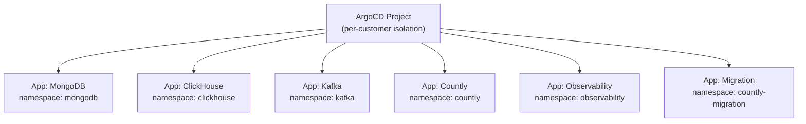

# Countly ArgoCD Helm Chart

App-of-apps pattern for deploying the full Countly stack to one or more Kubernetes clusters via ArgoCD. Creates an ArgoCD Project and one Application per component, each pointing to the appropriate chart and environment values.

**Chart version:** 0.1.0
**App version:** 1.0.0

---

## Architecture



Each child Application:
- Points to a specific chart under `charts/` in the Git repo
- Pulls environment-specific values from `environments/<name>/`
- Has its own sync policy, retry, and self-heal configuration
- Deploys into an isolated namespace with `CreateNamespace=true`

---

## Quick Start

```bash
helm install countly-stack ./charts/countly-argocd \
  -n argocd \
  --set environment=my-production \
  --set destination.server="https://kubernetes.default.svc"
```

This creates an ArgoCD Project and 5-6 Applications (depending on which components are enabled).

---

## Prerequisites

- **ArgoCD** installed and running on the management cluster
- **Git repository** accessible from ArgoCD (configured via `repoURL`)
- **Environment directory** at `environments/<environment>/` with per-chart value overrides
- **Operators** pre-installed on target cluster: ClickHouse Operator, Strimzi, MongoDB Community Operator

---

## Configuration

### Component Toggles

Each component can be independently enabled or disabled:

```yaml
mongodb:
  enabled: true
  namespace: mongodb

clickhouse:
  enabled: true
  namespace: clickhouse

kafka:
  enabled: true
  namespace: kafka

countly:
  enabled: true
  namespace: countly

observability:
  enabled: true
  namespace: observability

migration:
  enabled: false          # Opt-in: enable when migrating data
  namespace: countly-migration
```

### Sync Policy

```yaml
syncPolicy:
  automated: true         # Auto-sync on git push
  selfHeal: true          # Revert manual cluster changes
  prune: true             # Remove resources deleted from git
  retry:
    limit: 5
    backoff:
      duration: 5s
      factor: 2
      maxDuration: 3m
```

### Multi-Cluster

To deploy to a remote cluster, set `destination.server` to the target cluster's API endpoint (must be registered in ArgoCD):

```yaml
destination:
  server: "https://remote-cluster-api:6443"
```

See `examples/multi-cluster.yaml` for a complete example.

### Environment Structure

The chart expects environment-specific values at:

```
environments/<environment>/
  countly.yaml
  countly-clickhouse.yaml
  countly-kafka.yaml
  countly-mongodb.yaml
  countly-observability.yaml
  countly-migration.yaml    # optional
```

---

## Configuration Reference

| Key | Default | Description |
|-----|---------|-------------|
| `repoURL` | `https://github.com/Countly/helm.git` | Git repo URL for chart source |
| `targetRevision` | `main` | Git branch/tag/commit |
| `environment` | `example-production` | Environment name (maps to `environments/<name>/`) |
| `destination.server` | `https://kubernetes.default.svc` | Target cluster API server |
| `project` | `""` | ArgoCD project name (defaults to release name) |
| `mongodb.enabled` | `true` | Deploy MongoDB |
| `clickhouse.enabled` | `true` | Deploy ClickHouse |
| `kafka.enabled` | `true` | Deploy Kafka |
| `countly.enabled` | `true` | Deploy Countly application |
| `observability.enabled` | `true` | Deploy observability stack |
| `migration.enabled` | `false` | Deploy migration service |
| `syncPolicy.automated` | `true` | Enable auto-sync |
| `syncPolicy.selfHeal` | `true` | Enable self-heal |
| `syncPolicy.prune` | `true` | Enable resource pruning |

---

## Examples

See the `examples/` directory:

- **`applicationset.yaml`** — ArgoCD ApplicationSet for multi-environment deployments
- **`multi-cluster.yaml`** — Deploy Countly across multiple clusters
