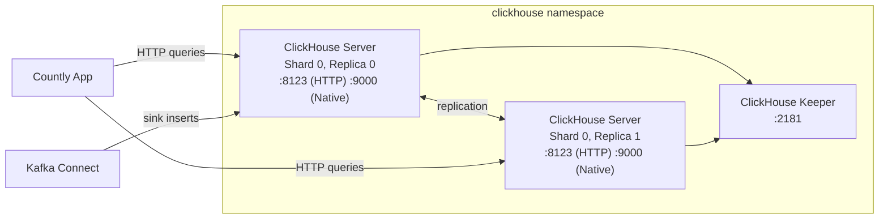

# Countly ClickHouse Helm Chart

Deploys a ClickHouse cluster for Countly analytics via the ClickHouse Operator. Includes ClickHouse server replicas, ClickHouse Keeper for coordination, and optional Prometheus monitoring.

**Chart version:** 0.1.0
**App version:** 26.2

---

## Architecture



The chart creates a `ClickHouseCluster` custom resource managed by the ClickHouse Operator. Keeper provides distributed coordination for replication and distributed DDL.

---

## Quick Start

```bash
helm install countly-clickhouse ./charts/countly-clickhouse \
  -n clickhouse --create-namespace \
  --set auth.defaultUserPassword.password="YOUR_PASSWORD"
```

> **Production deployment:** Use the profile-based approach from the [root README](../../README.md#manual-installation-without-helmfile) instead of `--set` flags. This chart supports sizing and security profile layers.

---

## Prerequisites

- **ClickHouse Operator** installed in the cluster (`clickhouse.com/v1alpha1` CRDs)
- **StorageClass** available for persistent volumes

---

## Configuration

### Cluster Sizing

```yaml
shards: 1             # Number of shards
replicas: 2           # Replicas per shard
version: "26.2"       # ClickHouse server version
```

### Server Resources

```yaml
server:
  resources:
    requests: { cpu: "1", memory: "4Gi" }
    limits:   { cpu: "2", memory: "8Gi" }
  persistence:
    storageClass: ""    # Uses cluster default if empty
    size: 50Gi
```

### Keeper Resources

```yaml
keeper:
  replicas: 1
  resources:
    requests: { cpu: "250m", memory: "512Mi" }
    limits:   { cpu: "500m", memory: "1Gi" }
  persistence:
    size: 5Gi
```

### Authentication

```yaml
auth:
  defaultUserPassword:
    password: ""              # Set on install (or use existingSecret)
    existingSecret: ""        # Name of pre-created Secret
    secretName: clickhouse-default-password
    key: password
  adminUser:
    enabled: false
    passwordSha256Hex: ""     # echo -n 'password' | sha256sum | cut -d' ' -f1
```

### OpenTelemetry Server-Side Tracing

```yaml
opentelemetry:
  enabled: false
  spanLog:
    ttlDays: 7
    flushIntervalMs: 1000
```

When enabled, ClickHouse logs query spans to `system.opentelemetry_span_log` for queries arriving with W3C `traceparent` headers.

### ArgoCD Integration

```yaml
argocd:
  enabled: true
```

---

## Verifying the Deployment

```bash
# 1. Check the ClickHouseCluster resource
kubectl get clickhousecluster -n clickhouse

# 2. Check pods are running
kubectl get pods -n clickhouse

# 3. Test ClickHouse connectivity
kubectl exec -n clickhouse countly-clickhouse-clickhouse-0-0-0 -- \
  clickhouse-client --password YOUR_PASSWORD --query "SELECT 1"

# 4. Check database exists
kubectl exec -n clickhouse countly-clickhouse-clickhouse-0-0-0 -- \
  clickhouse-client --password YOUR_PASSWORD --query "SHOW DATABASES"
```

---

## Configuration Reference

| Key | Default | Description |
|-----|---------|-------------|
| `version` | `26.2` | ClickHouse server version |
| `shards` | `1` | Number of shards |
| `replicas` | `2` | Replicas per shard |
| `database` | `countly_drill` | Default database name |
| `server.resources.requests.cpu` | `1` | Server CPU request |
| `server.resources.requests.memory` | `4Gi` | Server memory request |
| `server.persistence.size` | `50Gi` | Server data volume size |
| `keeper.replicas` | `1` | Number of Keeper nodes |
| `keeper.persistence.size` | `5Gi` | Keeper data volume size |
| `auth.defaultUserPassword.password` | `""` | Default user password |
| `podDisruptionBudget.server.enabled` | `false` | Server PDB |
| `serviceMonitor.enabled` | `false` | Prometheus ServiceMonitor |
| `networkPolicy.enabled` | `false` | NetworkPolicy |
