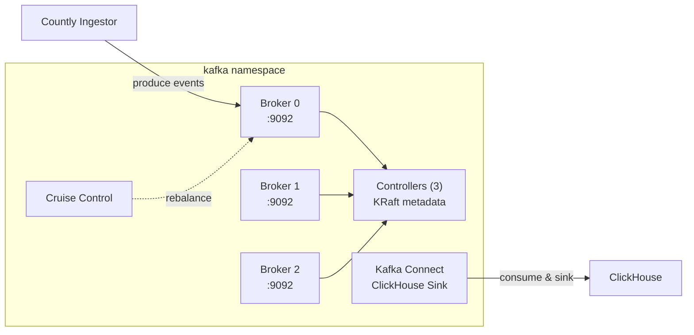

# Countly Kafka Helm Chart

Deploys Apache Kafka for Countly event streaming via the Strimzi Operator. Includes KRaft-mode brokers, controllers, Kafka Connect with the ClickHouse sink connector, and optional Cruise Control for partition rebalancing.

**Chart version:** 0.1.0
**App version:** 4.2.0

---

## Architecture



The chart creates Strimzi `Kafka`, `KafkaConnect`, and `KafkaConnector` custom resources. Brokers run in KRaft mode (no ZooKeeper). The ClickHouse sink connector reads from the `drill-events` topic and inserts into the `drill_events` table.

---

## Quick Start

```bash
helm install countly-kafka ./charts/countly-kafka \
  -n kafka --create-namespace \
  --set kafkaConnect.clickhouse.password="YOUR_CLICKHOUSE_PASSWORD"
```

> **Production deployment:** Use the profile-based approach from the [root README](../../README.md#manual-installation-without-helmfile) instead of `--set` flags. This chart supports sizing, kafka-connect, observability, and security profile layers.

---

## Prerequisites

- **Strimzi Kafka Operator** installed in the cluster (`kafka.strimzi.io/v1` CRDs)
- **StorageClass** available for persistent volumes
- **ClickHouse** accessible from the kafka namespace (for Kafka Connect sink)

---

## Configuration

### Brokers

```yaml
brokers:
  replicas: 3
  resources:
    requests: { cpu: "1", memory: "4Gi" }
    limits:   { cpu: "1", memory: "4Gi" }
  jvmOptions:
    xms: "2g"
    xmx: "2g"
  persistence:
    volumes:
      - id: 0
        size: 100Gi
  config:
    default.replication.factor: 2
    min.insync.replicas: 2
    auto.create.topics.enable: false
```

### Controllers

```yaml
controllers:
  replicas: 3
  resources:
    requests: { cpu: "500m", memory: "2Gi" }
    limits:   { cpu: "1", memory: "2Gi" }
  persistence:
    size: 20Gi
```

### Kafka Connect

```yaml
kafkaConnect:
  enabled: true
  name: connect-ch
  replicas: 2
  resources:
    requests: { cpu: "2", memory: "8Gi" }
    limits:   { cpu: "2", memory: "8Gi" }
  clickhouse:
    host: ""          # Auto-resolved from clickhouseNamespace if empty
    port: "8123"
    password: ""      # Required
    database: "countly_drill"
  hpa:
    enabled: false
    minReplicas: 1
    maxReplicas: 3
```

### Connectors

Connectors are defined as a list and rendered as `KafkaConnector` resources:

```yaml
kafkaConnect:
  connectors:
    - name: ch-sink-drill-events
      enabled: true
      state: running
      class: com.clickhouse.kafka.connect.ClickHouseSinkConnector
      tasksMax: 1
      config:
        topics: drill-events
        topic2TableMap: "drill-events=drill_events"
```

### OpenTelemetry (Kafka Connect)

```yaml
kafkaConnect:
  otel:
    enabled: false
    serviceName: "kafka-connect"
    exporterEndpoint: "http://alloy-otlp:4317"
```

### ArgoCD Integration

```yaml
argocd:
  enabled: true
```

---

## Verifying the Deployment

```bash
# 1. Check Kafka cluster status
kubectl get kafka -n kafka

# 2. Check all pods
kubectl get pods -n kafka

# 3. Check Kafka Connect
kubectl get kafkaconnect -n kafka

# 4. Check connectors
kubectl get kafkaconnectors -n kafka

# 5. Verify topic exists
kubectl exec -n kafka countly-kafka-countly-kafka-brokers-0 -- \
  bin/kafka-topics.sh --bootstrap-server localhost:9092 --list

# 6. Check connector status
kubectl exec -n kafka countly-kafka-countly-kafka-brokers-0 -- \
  bin/kafka-topics.sh --bootstrap-server localhost:9092 \
  --describe --topic drill-events
```

---

## Configuration Reference

| Key | Default | Description |
|-----|---------|-------------|
| `version` | `4.2.0` | Kafka version |
| `brokers.replicas` | `3` | Number of broker nodes |
| `brokers.persistence.volumes[0].size` | `100Gi` | Broker data volume size |
| `brokers.config.default.replication.factor` | `2` | Default topic replication |
| `brokers.config.min.insync.replicas` | `2` | Minimum in-sync replicas |
| `controllers.replicas` | `3` | Number of KRaft controllers |
| `controllers.persistence.size` | `20Gi` | Controller metadata volume |
| `kafkaConnect.enabled` | `true` | Deploy Kafka Connect |
| `kafkaConnect.replicas` | `2` | Connect worker replicas |
| `kafkaConnect.clickhouse.password` | `""` | ClickHouse password for sink |
| `kafkaConnect.hpa.enabled` | `false` | HPA for Connect workers |
| `cruiseControl.enabled` | `true` | Deploy Cruise Control |
| `metrics.enabled` | `true` | Enable JMX metrics |
| `networkPolicy.enabled` | `false` | NetworkPolicy |
