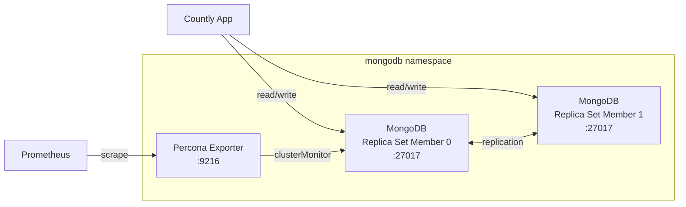

# Countly MongoDB Helm Chart

Deploys a MongoDB replica set for Countly via the MongoDB Community Operator. Includes application and metrics users, an optional Percona exporter for Prometheus scraping, and NetworkPolicy support.

**Chart version:** 0.1.0
**App version:** 8.2.5

---

## Architecture



The chart creates a `MongoDBCommunity` custom resource managed by the MongoDB Community Operator. The operator handles replica set initialization, user creation, and rolling upgrades.

---

## Quick Start

```bash
helm install countly-mongodb ./charts/countly-mongodb \
  -n mongodb --create-namespace \
  --set users.app.password="YOUR_APP_PASSWORD" \
  --set users.metrics.password="YOUR_METRICS_PASSWORD"
```

> **Production deployment:** Use the profile-based approach from the [root README](../../README.md#manual-installation-without-helmfile) instead of `--set` flags. This chart supports sizing and security profile layers.

---

## Prerequisites

- **MongoDB Community Operator** installed in the cluster (`mongodbcommunity.mongodb.com/v1` CRDs)
- **StorageClass** available for persistent volumes

---

## Configuration

### Replica Set

```yaml
mongodb:
  version: "8.2.5"
  members: 2
  resources:
    requests: { cpu: "500m", memory: "2Gi" }
    limits:   { cpu: "2", memory: "8Gi" }
  persistence:
    storageClass: ""      # Uses cluster default if empty
    size: 100Gi
```

### Users

Two users are created by default:

```yaml
users:
  app:
    name: app
    database: admin
    password: ""                    # Required on first install
    roles:
      - { name: readWriteAnyDatabase, db: admin }
      - { name: dbAdmin, db: admin }
  metrics:
    enabled: true
    name: metrics
    password: ""                    # Required when exporter is enabled
    roles:
      - { name: clusterMonitor, db: admin }
      - { name: read, db: local }
```

The `app` user password must match the password configured in the `countly` chart's `backingServices.mongodb.password` or `secrets.mongodb.password`.

### Percona Exporter

```yaml
exporter:
  enabled: true
  image: percona/mongodb_exporter:0.40.0
  port: 9216
  resources:
    requests: { cpu: "50m", memory: "64Mi" }
    limits:   { cpu: "200m", memory: "256Mi" }
```

### Scheduling

```yaml
mongodb:
  scheduling:
    nodeSelector: {}
    tolerations: []
    antiAffinity:
      enabled: true
      type: preferred
      topologyKey: kubernetes.io/hostname
```

### ArgoCD Integration

```yaml
argocd:
  enabled: true
```

---

## Verifying the Deployment

```bash
# 1. Check MongoDBCommunity resource
kubectl get mongodbcommunity -n mongodb

# 2. Check pods
kubectl get pods -n mongodb

# 3. Get the operator-generated connection string secret
kubectl get secret -n mongodb countly-mongodb-app-mongodb-conn \
  -o jsonpath='{.data.connectionString\.standard}' | base64 -d

# 4. Test connectivity
kubectl exec -n mongodb countly-mongodb-0 -c mongod -- \
  mongosh --eval "db.runCommand({ping: 1})"

# 5. Check replica set status
kubectl exec -n mongodb countly-mongodb-0 -c mongod -- \
  mongosh --eval "rs.status().members.map(m => ({name: m.name, state: m.stateStr}))"
```

---

## Configuration Reference

| Key | Default | Description |
|-----|---------|-------------|
| `mongodb.version` | `8.2.5` | MongoDB server version |
| `mongodb.members` | `2` | Number of replica set members |
| `mongodb.resources.requests.cpu` | `500m` | CPU request per member |
| `mongodb.resources.requests.memory` | `2Gi` | Memory request per member |
| `mongodb.persistence.size` | `100Gi` | Data volume size per member |
| `users.app.password` | `""` | Application user password (required) |
| `users.metrics.password` | `""` | Metrics user password |
| `exporter.enabled` | `true` | Deploy Percona MongoDB exporter |
| `exporter.port` | `9216` | Exporter metrics port |
| `podDisruptionBudget.enabled` | `false` | PDB for MongoDB members |
| `networkPolicy.enabled` | `false` | NetworkPolicy |
| `secrets.keep` | `true` | Preserve secrets on uninstall |
