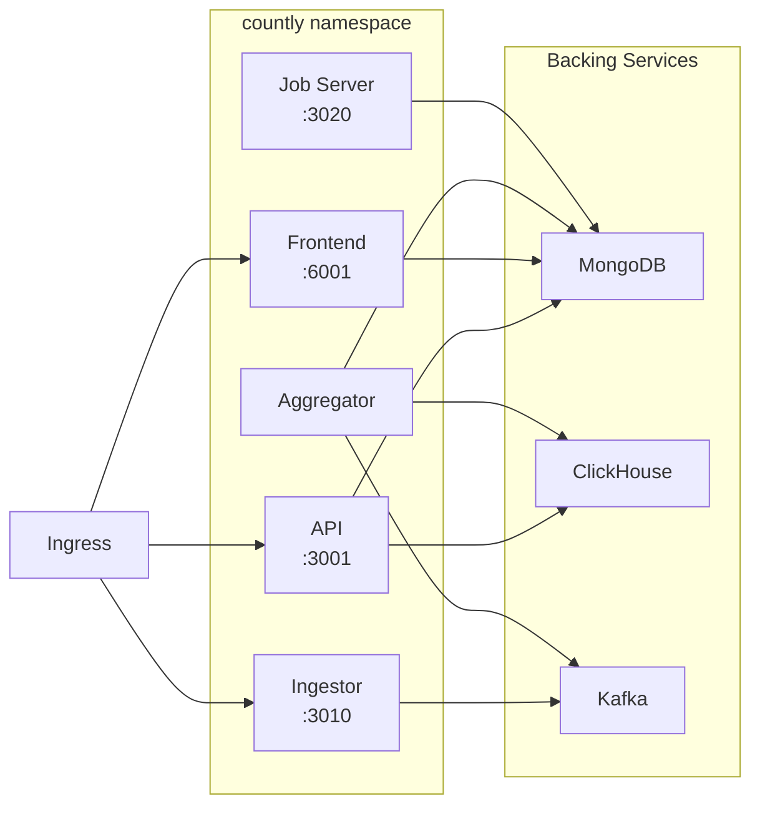

# Countly Helm Chart

Deploys the Countly web analytics platform as a set of microservices: API, Frontend, Ingestor, Aggregator, and Job Server. Each component runs as an independent Deployment with its own HPA, PDB, and scheduling configuration.

**Chart version:** 0.1.0
**App version:** 26.01

---

## Architecture



All five components share a common container image and are differentiated by their startup command (`npm run start:<component>`). Configuration is injected via ConfigMaps and Secrets.

---

## Quick Start

```bash
helm install countly ./charts/countly \
  -n countly --create-namespace \
  --set backingServices.mongodb.password="YOUR_MONGODB_PASSWORD" \
  --set ingress.hostname="countly.example.com"
```

This assumes MongoDB, ClickHouse, and Kafka are deployed in-cluster via the sibling charts (`countly-mongodb`, `countly-clickhouse`, `countly-kafka`).

> **Production deployment:** Use the profile-based approach from the [root README](../../README.md#manual-installation-without-helmfile) instead of `--set` flags. This chart supports sizing, TLS, observability, and security profile layers.

---

## Prerequisites

- **MongoDB** — Deployed via `countly-mongodb` chart or provided externally
- **ClickHouse** — Deployed via `countly-clickhouse` chart or provided externally
- **Kafka** — Deployed via `countly-kafka` chart or provided externally
- **Ingress controller** — NGINX Ingress Controller (F5 or community) for external access

---

## Components

| Component | Purpose | Default Port | Scales With |
|-----------|---------|-------------|-------------|
| API | REST API for data retrieval and management | 3001 | CPU/Memory (1-6 replicas) |
| Frontend | Dashboard UI and web server | 6001 | CPU (1 replica) |
| Ingestor | High-throughput event ingestion endpoint | 3010 | CPU/Memory (1-12 replicas) |
| Aggregator | Background data aggregation from Kafka/CH | None | CPU/Memory (4-8 replicas) |
| Job Server | Scheduled jobs, reports, push notifications | 3020 | CPU (1 replica) |

Each component can be independently enabled/disabled, scaled, and configured.

---

## Configuration

### Backing Services

Each backing service supports **bundled** (in-cluster sibling chart) or **external** (bring your own) mode.

```yaml
backingServices:
  mongodb:
    mode: bundled       # bundled | external
    # External-mode fields (used only when mode=external):
    connectionString: ""
    host: ""
    port: "27017"
    username: "app"
    password: ""
    existingSecret: ""
  clickhouse:
    mode: bundled       # bundled | external
    host: ""
    port: "8123"
    tls: "false"
    existingSecret: ""
  kafka:
    mode: bundled       # bundled | external
    brokers: ""
    existingSecret: ""
```

When `mode=bundled`, connection URLs are auto-constructed from in-cluster DNS using the release name and namespace conventions.

### Secrets

Three modes for managing credentials:

| Mode | Description | Use Case |
|------|-------------|----------|
| `values` (default) | Secrets created from Helm values | Development, testing |
| `existingSecret` | Reference pre-created Kubernetes Secrets | Production with manual secret management |
| `externalSecret` | External Secrets Operator (AWS SM, Azure KV, etc.) | Production with vault integration |

### Ingress

```yaml
ingress:
  enabled: true
  className: nginx
  hostname: countly.example.com
  tls:
    mode: http          # http | letsencrypt | existingSecret | selfSigned
    clusterIssuer: letsencrypt-prod
```

### Per-Component Configuration

Each component supports the same set of overrides:

```yaml
api:                              # or: frontend, ingestor, aggregator, jobserver
  enabled: true
  replicaCount: 1
  resources:
    requests: { cpu: "1", memory: "3.5Gi" }
    limits:   { cpu: "1", memory: "4Gi" }
  hpa:
    enabled: true
    minReplicas: 1
    maxReplicas: 6
    metrics:
      cpu: { averageUtilization: 70 }
  pdb:
    enabled: false
  scheduling:
    nodeSelector: {}
    tolerations: []
    antiAffinity:
      enabled: true
      type: preferred
      topologyKey: kubernetes.io/hostname
  extraEnv: []
  extraEnvFrom: []
```

### ArgoCD Integration

```yaml
argocd:
  enabled: true
```

When enabled, all resources get sync-wave annotations for ordered deployment.

---

## Verifying the Deployment

```bash
# 1. Check all pods are running
kubectl get pods -n countly

# 2. Check API health
kubectl exec -n countly deploy/countly-api -- \
  node -e "fetch('http://localhost:3001/o/ping').then(r=>r.text()).then(console.log)"

# 3. Check Frontend health
kubectl exec -n countly deploy/countly-frontend -- \
  node -e "fetch('http://localhost:6001/ping').then(r=>r.text()).then(console.log)"

# 4. View logs for a component
kubectl logs -n countly -l app.kubernetes.io/component=api -f
```

---

## Configuration Reference

| Key | Default | Description |
|-----|---------|-------------|
| `image.repository` | `gcr.io/countly-dev-313620/countly-unified` | Container image |
| `image.tag` | `26.01` | Image tag |
| `backingServices.mongodb.mode` | `bundled` | MongoDB connection mode |
| `backingServices.clickhouse.mode` | `bundled` | ClickHouse connection mode |
| `backingServices.kafka.mode` | `bundled` | Kafka connection mode |
| `secrets.mode` | `values` | Secret management mode |
| `ingress.hostname` | `countly.example.com` | Ingress hostname |
| `ingress.tls.mode` | `http` | TLS mode: http, letsencrypt, existingSecret, selfSigned |
| `config.common.COUNTLY_PLUGINS` | (long list) | Enabled Countly plugins |
| `nodeOptions.<component>` | Varies | Node.js `--max-old-space-size` per component |
| `networkPolicy.enabled` | `false` | Enable NetworkPolicy |
