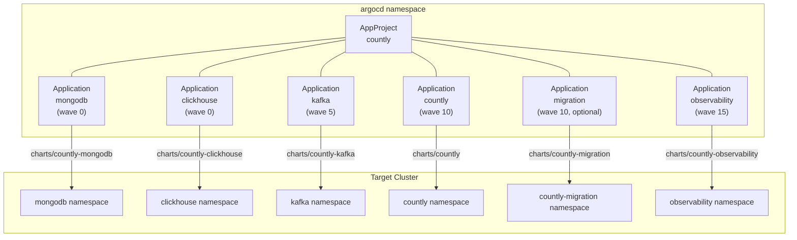

# ArgoCD Deployment

Deploy the Countly analytics platform using ArgoCD's GitOps model. The `countly-argocd` chart implements an **app-of-apps** pattern: one Helm release creates an `AppProject` and up to 6 `Application` CRs, each pointing to a child Helm chart in its own namespace.

## Quick Start

### Prerequisites

1. **ArgoCD** installed on a management cluster (v2.8+)
2. **Required operators** installed on the target cluster — see [PREREQUISITES.md](PREREQUISITES.md)
3. **Git repo** accessible to ArgoCD (HTTPS or SSH)
4. **Custom health checks** configured in ArgoCD — see [Custom Health Checks](#custom-health-checks-required)

### Deploy

1. **Prepare your environment:**
   ```bash
   cp -r environments/reference environments/my-env
   ```
   Edit `environments/my-env/global.yaml` — set `ingress.hostname`, sizing, TLS, security profiles.
   Fill in credential files (`credentials-mongodb.yaml`, `credentials-clickhouse.yaml`, etc.).

2. **Install the ArgoCD chart:**
   ```bash
   helm install countly charts/countly-argocd \
     --set environment=my-env \
     --set destination.server=https://kubernetes.default.svc \
     -n argocd
   ```

3. **Verify all Applications sync:**
   ```bash
   kubectl get applications -n argocd -l app.kubernetes.io/instance=countly
   ```

4. **Watch sync progress:**
   ```bash
   argocd app list -l app.kubernetes.io/instance=countly
   ```

5. **Access Countly** once all apps show `Healthy` / `Synced` — visit the ingress hostname configured in `global.yaml`.

### Enable the Migration Service

The batch migration service (MongoDB to ClickHouse) is disabled by default:

```bash
helm upgrade countly charts/countly-argocd \
  --set migration.enabled=true \
  -n argocd --reuse-values
```

---

## Architecture



Each Application:
- Points to a chart path in the Git repo (`repoURL` + `targetRevision`)
- Layers value files: `global.yaml` -> `profiles` -> `environment` -> `secrets`
- Injects `argocd.enabled=true` via Helm parameters (activates sync-wave annotations in child charts)

---

## Sync Waves

ArgoCD processes resources in sync-wave order. Lower waves complete before higher waves start. The Countly deployment uses **two levels** of sync-wave ordering.

### Application-Level Waves (between charts)

These control the order in which the 6 child charts deploy:

| Wave | Applications | Purpose |
|------|-------------|---------|
| **0** | mongodb, clickhouse | Data stores deploy first |
| **5** | kafka | Message broker — depends on databases for Kafka Connect sink |
| **10** | countly, migration | Application layer — depends on all backing services |
| **15** | observability | Monitoring — deploys last, needs targets to scrape |

Wave 5 (Kafka) **will not start** until all Wave 0 Applications (MongoDB, ClickHouse) report `Healthy`. This requires [custom health checks](#custom-health-checks-required).

### Resource-Level Waves (within each chart)

When `argocd.enabled=true` is set (done automatically by the ArgoCD chart), each child chart annotates its resources with `argocd.argoproj.io/sync-wave`. All charts use an identical helper function:

```gotemplate
{{- define "<chart>.syncWave" -}}
{{- if .root.Values.argocd.enabled }}
argocd.argoproj.io/sync-wave: {{ .wave | quote }}
{{- end }}
{{- end -}}
```

This ensures that within each Application, resources are created in dependency order (namespaces before secrets, secrets before deployments, etc.).

### Complete Resource-Level Wave Map

#### countly

| Wave | Resources |
|------|-----------|
| 0 | Namespace, ServiceAccount |
| 1 | Secrets (common, mongodb, kafka, clickhouse), ExternalSecrets |
| 2 | ConfigMaps (common, api, aggregator, frontend, ingestor, jobserver, clickhouse, kafka, otel) |
| 5 | Deployments (API, Frontend, Ingestor, Aggregator, JobServer) |
| 10 | Ingress, TLS self-signed ClusterIssuer |
| 11 | TLS CA Certificate |
| 12 | TLS CA Issuer |

#### countly-mongodb

| Wave | Resources |
|------|-----------|
| 0 | Namespace, NetworkPolicy, Secrets (user + keyfile) |
| 5 | MongoDBCommunity CR, PodDisruptionBudget |
| 10 | MongoDB Exporter Deployment, ServiceMonitor |

#### countly-clickhouse

| Wave | Resources |
|------|-----------|
| 0 | Namespace, NetworkPolicy, Secret (default password) |
| 3 | PodDisruptionBudget (Keeper) |
| 5 | ClickHouseCluster CR, KeeperCluster CR, PodDisruptionBudget (Server) |
| 10 | ServiceMonitors, Metrics Services |

#### countly-kafka

| Wave | Resources |
|------|-----------|
| 0 | Namespace, ConfigMaps (connect-env, metrics), NetworkPolicies, Secret (ClickHouse connect) |
| 5 | Kafka CR, KafkaNodePool CRs |
| 10 | KafkaConnect CR, HPA |
| 15 | KafkaConnector CRs |

#### countly-migration

| Wave | Resources |
|------|-----------|
| 0 | ServiceAccount, ConfigMap, NetworkPolicy, ExternalSecret |
| 1 | Secret |
| 10 | Deployment, Service, Ingress, ServiceMonitor |

Namespace is **not** rendered by the chart when using ArgoCD — `CreateNamespace=true` in the Application handles it.

#### countly-observability

| Wave | Resources |
|------|-----------|
| 0 | ServiceAccount, NetworkPolicy |
| 5 | Ingress |

---

## Sync Policy

All Applications share a common sync policy defined in the chart's `_helpers.tpl`:

| Option | Default | Purpose |
|--------|---------|---------|
| `syncPolicy.automated` | `true` | Enable automatic sync from Git |
| `syncPolicy.prune` | `true` | Delete resources removed from Git |
| `syncPolicy.selfHeal` | `true` | Revert manual changes back to Git state |
| `CreateNamespace=true` | Always | ArgoCD creates target namespaces — charts don't need to |
| `ServerSideApply=true` | Always | Required for large CRDs (ClickHouse, Kafka, MongoDB operators) |
| `RespectIgnoreDifferences=true` | Always | Honors per-resource ignoreDifferences |
| `retry.limit` | `5` | Maximum sync retry attempts |
| `retry.backoff.duration` | `5s` | Initial retry delay |
| `retry.backoff.factor` | `2` | Exponential backoff multiplier |
| `retry.backoff.maxDuration` | `3m` | Maximum retry delay |

### Disable Automated Sync

For manual-sync-only workflows (e.g., staging environments with approval gates):

```bash
helm install countly charts/countly-argocd \
  --set syncPolicy.automated=false \
  -n argocd
```

---

## Custom Health Checks (Required)

ArgoCD does not know how to assess health of operator-managed CRDs by default. **Without custom health checks, sync waves cannot block on actual readiness** — Wave 5 (Kafka) would start immediately instead of waiting for Wave 0 databases to become healthy.

Add the following to the `argocd-cm` ConfigMap in the `argocd` namespace:

### Strimzi Kafka

Applies to: `Kafka`, `KafkaConnect`, `KafkaNodePool`, `KafkaConnector`

```yaml
resource.customizations.health.kafka.strimzi.io_Kafka: |
  hs = {}
  if obj.status ~= nil and obj.status.conditions ~= nil then
    for _, c in ipairs(obj.status.conditions) do
      if c.type == "Ready" and c.status == "True" then
        hs.status = "Healthy"; hs.message = c.message or "Ready"; return hs
      end
      if c.type == "NotReady" then
        hs.status = "Progressing"; hs.message = c.message or "Not ready"; return hs
      end
    end
  end
  hs.status = "Progressing"; hs.message = "Waiting for status"; return hs
```

Use the same Lua script for `KafkaConnect`, `KafkaNodePool`, and `KafkaConnector` — replace `_Kafka` with `_KafkaConnect`, `_KafkaNodePool`, or `_KafkaConnector` in the key name.

### ClickHouse

```yaml
resource.customizations.health.clickhouse.com_ClickHouseCluster: |
  hs = {}
  if obj.status ~= nil and obj.status.status ~= nil then
    if obj.status.status == "Completed" then
      hs.status = "Healthy"; hs.message = "Completed"; return hs
    end
  end
  hs.status = "Progressing"; hs.message = "Provisioning"; return hs
```

### MongoDB

```yaml
resource.customizations.health.mongodbcommunity.mongodb.com_MongoDBCommunity: |
  hs = {}
  if obj.status ~= nil and obj.status.phase ~= nil then
    if obj.status.phase == "Running" then
      hs.status = "Healthy"; hs.message = "Running"; return hs
    end
  end
  hs.status = "Progressing"; hs.message = "Provisioning"; return hs
```

### How to Apply

**Option 1:** Edit the ConfigMap directly:
```bash
kubectl edit configmap argocd-cm -n argocd
```

**Option 2:** If ArgoCD is deployed via Helm, add the health checks to the ArgoCD Helm values:
```yaml
# argocd-values.yaml
server:
  config:
    resource.customizations.health.kafka.strimzi.io_Kafka: |
      ...
```

**Option 3:** Use Kustomize to patch the ConfigMap in your ArgoCD deployment manifests.

---

## ignoreDifferences

Operator-managed CRDs have `/status` fields that operators constantly update. Without `ignoreDifferences`, ArgoCD would show these Applications as perpetually "OutOfSync" even when nothing changed in Git.

The `countly-argocd` chart configures `ignoreDifferences` per Application:

| Application | API Group | Kind | Ignored Path |
|-------------|-----------|------|-------------|
| mongodb | `mongodbcommunity.mongodb.com` | `MongoDBCommunity` | `/status` |
| clickhouse | `clickhouse.com` | `ClickHouseCluster` | `/status` |
| clickhouse | `clickhouse.com` | `KeeperCluster` | `/status` |
| kafka | `kafka.strimzi.io` | `Kafka` | `/status` |
| kafka | `kafka.strimzi.io` | `KafkaConnect` | `/status` |
| kafka | `kafka.strimzi.io` | `KafkaConnector` | `/status` |
| kafka | `kafka.strimzi.io` | `KafkaNodePool` | `/status` |
| countly | `networking.k8s.io` | `Ingress` | `/status` |

These are configured automatically — no manual action required. The `RespectIgnoreDifferences=true` sync option ensures ArgoCD honors them.

---

## AppProject

Each Helm release creates an isolated `AppProject`:

```yaml
spec:
  description: "Countly analytics platform (<environment>)"
  sourceRepos:
    - <repoURL>                    # Restricted to configured repo
  destinations:
    - namespace: "*"
      server: <destination.server> # Restricted to configured cluster
  clusterResourceWhitelist:
    - group: storage.k8s.io        # StorageClass
      kind: StorageClass
    - group: rbac.authorization.k8s.io
      kind: ClusterRole             # Operator RBAC
    - group: rbac.authorization.k8s.io
      kind: ClusterRoleBinding
    - group: cert-manager.io
      kind: ClusterIssuer           # TLS issuers
  namespaceResourceWhitelist:
    - group: "*"
      kind: "*"
  orphanedResources:
    warn: true                      # Warn but don't prune orphans
```

Key design decisions:
- **Source isolation**: Each project only allows the configured `repoURL`
- **Cluster isolation**: Each project only allows the configured destination cluster
- **Cluster resources**: Whitelisted for StorageClass, RBAC, and ClusterIssuer — the minimum needed by Countly charts
- **Orphan detection**: Warns on resources in target namespaces not tracked by any Application

---

## Multi-Tenant Deployment

The chart is designed for multi-tenant environments where each customer gets an isolated Countly deployment.

### One Release Per Customer

```bash
# Customer A — production cluster
helm install customer-a charts/countly-argocd \
  --set environment=customer-a \
  --set project=countly-customer-a \
  --set destination.server=https://cluster-a.example.com \
  --set global.sizing=production \
  --set global.security=hardened \
  -n argocd

# Customer B — small cluster
helm install customer-b charts/countly-argocd \
  --set environment=customer-b \
  --set project=countly-customer-b \
  --set destination.server=https://cluster-b.example.com \
  --set global.sizing=small \
  --set global.security=open \
  -n argocd
```

Each release creates:
- 1 isolated `AppProject` (named after the release or `project` override)
- Up to 6 `Application` CRs with unique names (`<release>-mongodb`, `<release>-clickhouse`, etc.)
- Target namespaces created automatically by `CreateNamespace=true`

See `charts/countly-argocd/examples/multi-cluster.yaml` for a complete values file.

### ApplicationSet Alternative

For 50+ customers where maintaining individual Helm releases is unwieldy, use an `ApplicationSet` with a list generator:

```yaml
apiVersion: argoproj.io/v1alpha1
kind: ApplicationSet
metadata:
  name: countly-mongodb
  namespace: argocd
spec:
  generators:
    - list:
        elements:
          - customer: customer-a
            server: https://cluster-a.example.com
            sizing: production
            security: hardened
          - customer: customer-b
            server: https://cluster-b.example.com
            sizing: small
            security: open
  template:
    metadata:
      name: "{{customer}}-mongodb"
      annotations:
        argocd.argoproj.io/sync-wave: "0"
    spec:
      project: "{{customer}}"
      source:
        repoURL: https://github.com/Countly/helm.git
        targetRevision: main
        path: charts/countly-mongodb
        helm:
          valueFiles:
            - "../../environments/{{customer}}/global.yaml"
            - "../../profiles/sizing/{{sizing}}/mongodb.yaml"
            - "../../profiles/security/{{security}}/mongodb.yaml"
            - "../../environments/{{customer}}/mongodb.yaml"
          parameters:
            - name: argocd.enabled
              value: "true"
      destination:
        server: "{{server}}"
        namespace: mongodb
```

Create one ApplicationSet per component (MongoDB, ClickHouse, Kafka, Countly, Observability, Migration). See `charts/countly-argocd/examples/applicationset.yaml` for the full example.

---

## Migration Service

The `countly-migration` chart deploys a MongoDB-to-ClickHouse batch migration service. It is fully ArgoCD-compatible:

- **Wave 10**: Deploys in parallel with Countly, after databases and Kafka are healthy
- **Disabled by default**: Enable with `--set migration.enabled=true`
- **Bundled Redis**: Includes a Bitnami Redis subchart for hot-state caching. No separate Redis Application needed — Redis pods deploy in the same namespace (`countly-migration`)
- **Singleton**: `values.schema.json` enforces `replicas: 1` and `strategy: Recreate` to prevent concurrent migration runs
- **External progress link**: When `externalLink.enabled=true`, the Deployment gets a `link.argocd.argoproj.io/progress` annotation. This renders as a clickable link in the ArgoCD UI pointing to the migration progress endpoint

```yaml
# Enable migration with progress link
migration:
  enabled: true

# In the migration values file:
argocd:
  enabled: true
externalLink:
  enabled: true
  url: "https://migration.example.internal/runs/current"
```

See [charts/countly-migration/README.md](../charts/countly-migration/README.md) for full configuration.

---

## Value File Layering

Each Application layers Helm value files in a specific order. Later files override earlier ones:

1. `environments/<env>/global.yaml` — environment-wide defaults
2. `profiles/sizing/<sizing>/<chart>.yaml` — CPU, memory, replicas, HPA, PDBs
3. `profiles/<dimension>/<value>/<chart>.yaml` — additional profiles per chart:

   | Chart | Extra Profiles |
   |-------|---------------|
   | countly | `tls/<tls>`, `observability/<obs>`, `security/<sec>` |
   | countly-kafka | `kafka-connect/<kc>`, `observability/<obs>`, `security/<sec>` |
   | countly-clickhouse | `security/<sec>` |
   | countly-mongodb | `security/<sec>` |
   | countly-observability | `observability/<obs>`, `security/<sec>` |
   | countly-migration | *(no profiles — uses environment values only)* |

4. `environments/<env>/<chart>.yaml` — environment-specific overrides
5. `environments/<env>/secrets-<chart>.yaml` — credentials (gitignored)

Additionally, the ArgoCD chart injects `argocd.enabled=true` via Helm `parameters` (not value files). This activates sync-wave annotations in each child chart.

---

## Configuration Reference

Full `countly-argocd` values:

```yaml
# Git repo containing the Helm charts
repoURL: "https://github.com/Countly/helm.git"
targetRevision: main

# Environment name (maps to environments/<name>/ directory)
environment: example-production

# Target cluster
destination:
  server: "https://kubernetes.default.svc"

# ArgoCD project name (defaults to release name if empty)
# Each customer MUST have a unique project to avoid collisions
project: ""

# Profile selections (passed to child charts via valueFiles)
global:
  sizing: production        # local | small | production
  security: hardened        # open | hardened
  tls: letsencrypt          # none | letsencrypt | provided | selfSigned
  observability: full       # disabled | full | external-grafana | external
  kafkaConnect: balanced    # throughput | balanced | low-latency

# Component toggles
mongodb:
  enabled: true
  namespace: mongodb
clickhouse:
  enabled: true
  namespace: clickhouse
kafka:
  enabled: true
  namespace: kafka
countly:
  enabled: true
  namespace: countly
observability:
  enabled: true
  namespace: observability
migration:
  enabled: false            # Disabled by default
  namespace: countly-migration

# Sync policy for all child Applications
syncPolicy:
  automated: true
  selfHeal: true
  prune: true
  retry:
    limit: 5
    backoff:
      duration: 5s
      factor: 2
      maxDuration: 3m
```

---

## Deployment Methods

| Method | Best For | Orchestration | Prerequisites |
|--------|----------|---------------|---------------|
| **Helmfile** | CI/CD pipelines, single-cluster | `helmfile apply` handles ordering via `needs:` | Helmfile CLI |
| **ArgoCD** (this chart) | GitOps, multi-cluster, multi-tenant | App-of-apps with sync waves | ArgoCD + operators + health checks |
| **Manual `helm install`** | Single-chart testing, development | User runs commands in dependency order | Helm CLI |

### When to Use ArgoCD

- You want GitOps: changes to the Git repo automatically sync to the cluster
- You manage multiple customers or clusters from a single ArgoCD instance
- You need drift detection (`selfHeal`) and automated pruning
- You want a UI for monitoring deployment status across all components

### When to Use Helmfile

- You deploy from a CI/CD pipeline (e.g., GitHub Actions, GitLab CI)
- You deploy to a single cluster
- You don't need continuous reconciliation
- You want simpler tooling without ArgoCD infrastructure

---

## Troubleshooting

| Symptom | Cause | Fix |
|---------|-------|-----|
| Application stuck "Progressing" forever | Custom health checks not configured | Add Lua health checks to `argocd-cm` — see [Custom Health Checks](#custom-health-checks-required) |
| Application shows "OutOfSync" constantly | Operator `/status` fields changing | Verify `ignoreDifferences` is applied (it's automatic from the chart) |
| "the server could not find the requested resource" | CRDs not installed | Install operators first — see [PREREQUISITES.md](PREREQUISITES.md) |
| Namespace already exists error | Both chart and ArgoCD creating namespace | Ensure `namespace.create: false` in chart values (automatic when `argocd.enabled=true`) |
| Large CRD apply fails | Client-side apply can't handle large objects | `ServerSideApply=true` is set by default — verify it's in syncOptions |
| Wave N starts before Wave N-1 is healthy | Missing health checks | ArgoCD cannot determine health without custom Lua checks — see above |
| "Secret not found" during sync | Missing secrets file | Ensure `environments/<env>/secrets-<chart>.yaml` exists with required values |
| "Permission denied" on cluster resource | AppProject too restrictive | Check `clusterResourceWhitelist` includes the resource group/kind |
| Migration not deploying | Migration disabled | Set `migration.enabled: true` in values |
| Redis not starting in migration namespace | Redis subchart disabled | Set `redis.enabled: true` in migration values (enabled by default) |

### Useful Commands

```bash
# List all Countly Applications
kubectl get applications -n argocd -l app.kubernetes.io/instance=<release-name>

# Sync all Applications
argocd app sync -l app.kubernetes.io/instance=<release-name>

# Check sync status
argocd app list -l app.kubernetes.io/instance=<release-name>

# View Application details
argocd app get <release-name>-mongodb

# Force refresh from Git
argocd app get <release-name>-mongodb --refresh

# Teardown (cascading — finalizers delete all child resources)
helm uninstall <release-name> -n argocd
```
